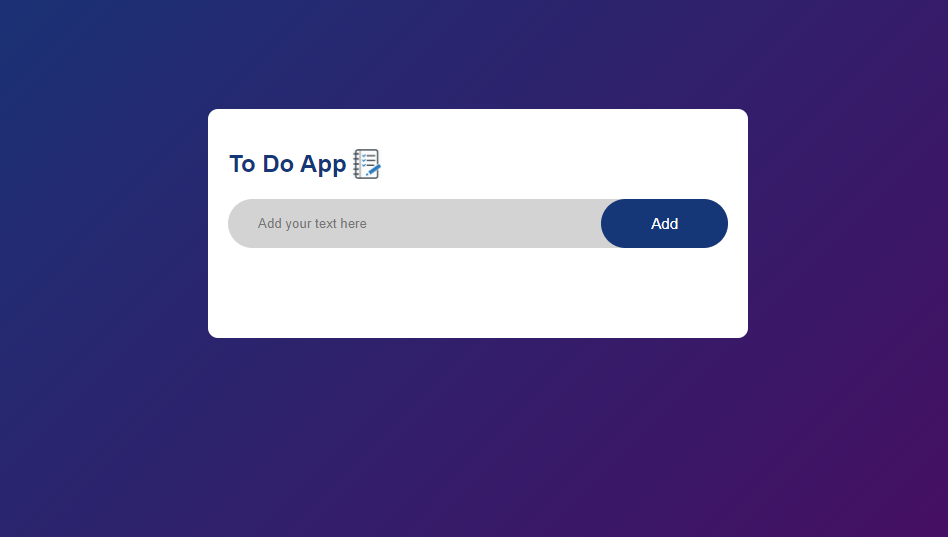

# Simple Todo App

## Overview

The **Simple Todo App** is a web application designed to help users manage their daily tasks. It allows users to add, edit, and delete tasks, as well as mark them as complete.

## Features

- Add new tasks
- Edit existing tasks
- Delete tasks
- Mark tasks as complete
- Persistent storage using local storage

## Demo

[Link to Demo](http://192.168.1.9:63239/index.html)

## Screenshots

### Main Interface



### Adding a Task


### Completed Tasks


## Installation

To run this project locally, follow these steps:

1. Clone the repository:
   ```bash
   git clone https://github.com/arshthakur/Todo-List.git
   ```
2. Navigate to the project directory:
   ```bash
   cd Todo-List
   ```
3. Open `index.html` in your web browser.

## Usage

1. Open the application in your browser.
2. Use the input field to add new tasks.
3. Click on a task to mark it as complete.
4. Use the edit button to modify a task.
5. Use the delete button to remove a task.

## Technologies Used

- HTML
- CSS
- JavaScript

## Contributing

Contributions are welcome! To contribute to this project, follow these steps:

1. Fork the repository.
2. Create a new branch:
   ```bash
   git checkout -b feature-branch
   ```
3. Make your changes.
4. Commit your changes:
   ```bash
   git commit -m 'Add some feature'
   ```
5. Push to the branch:
   ```bash
   git push origin feature-branch
   ```
6. Open a pull request.

## Contact

If you have any questions or suggestions, feel free to contact me at [harshthakur0047@gmail.com].
